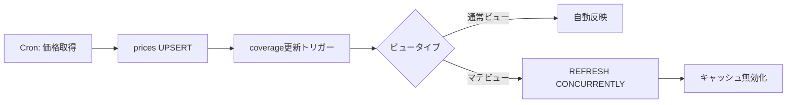

# カバレッジ一覧機能 AS-IS/TO-BE 要件定義書

## 1. 概要

### 1.1 目的
既存の調整済OHLCV APIに、保存済みデータのカバレッジ（データ範囲）を一覧表示する機能を追加する。

### 1.2 背景
- 現在はティッカーごとのデータ保存状況を俯瞰できない
- データ取得戦略の立案や欠損確認が困難
- フロントエンドから効率的にデータ状況を把握したい

---

## 2. AS-IS（現状）

### 2.1 既存エンドポイント
| エンドポイント | 機能 | 出力内容 |
|--------------|------|---------|
| `GET /healthz` | ヘルスチェック | `{"status": "ok"}` |
| `GET /v1/symbols` | シンボル一覧 | メタデータ（name, exchange, currency等） |
| `GET /v1/prices` | 価格データ取得 | 指定期間のOHLCV |
| `GET /v1/metrics` | メトリクス計算 | CAGR, STDEV, MaxDD |

### 2.2 データベース構造
```sql
-- 既存テーブル
symbols (symbol, name, exchange, currency, is_active, first_date, last_date)
symbol_changes (old_symbol, new_symbol, change_date, reason)
prices (symbol, date, open, high, low, close, volume, source, last_updated)

-- 既存の集計機能
get_prices_resolved() -- シンボル変更の透過解決
```

### 2.3 制限事項
- **カバレッジ確認不可**：どのティッカーにどの期間のデータが存在するか一覧できない
- **集計処理なし**：min/max日付の取得は都度フルスキャン
- **フィルタ不足**：期間・データ有無での絞り込み不可
- **エクスポート機能なし**：CSV出力未対応

### 2.4 運用フロー
1. yfinanceから価格データ取得
2. `prices`テーブルにUPSERT
3. APIリクエスト時に都度計算

---

## 3. TO-BE（目標状態）

### 3.1 新規エンドポイント

#### 3.1.1 カバレッジ一覧API
```http
GET /v1/coverage
```

**クエリパラメータ**：
| パラメータ | 型 | 説明 | デフォルト |
|-----------|---|------|-----------|
| `page` | int | ページ番号 | 1 |
| `page_size` | int | 1ページあたりの件数 | 50 |
| `q` | string | 検索（symbol/name部分一致） | - |
| `sort_by` | enum | ソート項目 | "symbol" |
| `order` | enum | ソート順序（asc/desc） | "asc" |
| `has_data` | bool | データ有無フィルタ | - |
| `start_after` | date | データ開始日がこの日付以降 | - |
| `end_before` | date | データ終了日がこの日付以前 | - |
| `updated_after` | datetime | 更新日時フィルタ | - |

**レスポンス**：
```json
{
  "items": [
    {
      "symbol": "AAPL",
      "name": "Apple Inc.",
      "exchange": "NASDAQ",
      "currency": "USD",
      "is_active": true,
      "data_start": "2020-01-02",
      "data_end": "2025-09-04",
      "data_days": 1435,
      "row_count": 1435,
      "last_updated": "2025-09-05T08:12:34Z",
      "has_gaps": false
    }
  ],
  "pagination": {
    "page": 1,
    "page_size": 50,
    "total_items": 1234,
    "total_pages": 25
  },
  "meta": {
    "query_time_ms": 42,
    "cached": true,
    "cache_updated_at": "2025-09-05T06:00:00Z"
  }
}
```

#### 3.1.2 CSV エクスポート
```http
GET /v1/coverage/export
```
- 同じクエリパラメータ対応
- `Content-Type: text/csv`
- ファイル名：`coverage_YYYYMMDD_HHMMSS.csv`

### 3.2 データベース拡張

#### 3.2.1 カバレッジビュー（通常ビュー）
```sql
CREATE VIEW v_symbol_coverage AS
SELECT 
    s.symbol,
    s.name,
    s.exchange,
    s.currency,
    s.is_active,
    MIN(p.date) AS data_start,
    MAX(p.date) AS data_end,
    COUNT(DISTINCT p.date) AS data_days,
    COUNT(*) AS row_count,
    MAX(p.last_updated) AS last_updated,
    -- ギャップ検出（簡易版）
    CASE 
        WHEN COUNT(*) > 0 AND 
             (MAX(p.date) - MIN(p.date) + 1) > COUNT(DISTINCT p.date)
        THEN true 
        ELSE false 
    END AS has_gaps
FROM symbols s
LEFT JOIN prices p ON s.symbol = p.symbol
GROUP BY s.symbol, s.name, s.exchange, s.currency, s.is_active;

-- インデックス（パフォーマンス向上）
CREATE INDEX idx_prices_symbol_date ON prices(symbol, date);
CREATE INDEX idx_prices_last_updated ON prices(last_updated);
```

#### 3.2.2 マテリアライズドビュー（オプション）
```sql
-- 大量データ時の高速化用
CREATE MATERIALIZED VIEW mv_symbol_coverage AS
SELECT ... -- 同上のSELECT文
WITH DATA;

-- 非ブロッキング更新用のユニークインデックス
CREATE UNIQUE INDEX idx_mv_coverage_symbol ON mv_symbol_coverage(symbol);

-- 更新（日次Cron後）
REFRESH MATERIALIZED VIEW CONCURRENTLY mv_symbol_coverage;
```

### 3.3 サービス層の追加

#### 3.3.1 新規サービスモジュール
```
app/services/coverage.py
├── get_coverage_stats()     # カバレッジ統計取得
├── filter_coverage()         # フィルタリング処理
├── sort_coverage()          # ソート処理
├── export_coverage_csv()    # CSV生成
└── refresh_coverage_cache() # キャッシュ更新
```

#### 3.3.2 スキーマ定義
```
app/schemas/coverage.py
├── CoverageItemOut         # 1件のカバレッジ情報
├── CoverageListOut         # ページネーション付きレスポンス
├── CoverageFilterParams    # フィルタパラメータ
└── CoverageExportFormat    # エクスポート形式
```

### 3.4 運用改善

#### 3.4.1 更新フロー


#### 3.4.2 監視項目
- カバレッジ更新の遅延時間
- ギャップ検出数の急増
- 特定銘柄の更新停止アラート

### 3.5 パフォーマンス目標

| 操作 | AS-IS | TO-BE目標 | 実現方法 |
|-----|-------|----------|---------|
| 全件一覧（1000件） | - | <100ms | ビュー+インデックス |
| 検索・フィルタ | - | <200ms | 部分インデックス |
| ソート | - | <150ms | 事前計算+インデックス |
| CSV出力（5000件） | - | <3秒 | ストリーミング出力 |
| キャッシュ更新 | - | <10秒 | CONCURRENTLY更新 |

---

## 4. 実装順序

### Phase 1: 基本機能（MVP）
1. **通常ビュー作成**（v_symbol_coverage）
2. **基本API実装**（/v1/coverage）
   - ページネーション
   - 基本ソート（symbol, data_start, data_end）
3. **Alembicマイグレーション**（004_coverage_view）

### Phase 2: 検索・フィルタ
1. **検索機能**（symbol/name部分一致）
2. **期間フィルタ**（start_after, end_before）
3. **データ有無フィルタ**（has_data）
4. **インデックス最適化**

### Phase 3: エクスポート・高速化
1. **CSV出力機能**（/v1/coverage/export）
2. **マテリアライズドビュー検討**
3. **更新自動化**（Cron連携）
4. **キャッシュ層**（Redis検討）

### Phase 4: 監視・改善
1. **ギャップ詳細検出**
2. **更新監視ダッシュボード**
3. **パフォーマンスチューニング**

---

## 5. 技術的制約・決定事項

### 5.1 制約
- **既存APIとの互換性維持**：/v1/prices等は変更しない
- **データベース負荷**：マテビュー更新は営業時間外に実施
- **レスポンス上限**：1回のAPIで最大10,000件

### 5.2 決定事項
- **日付基準**：全て日付（DATE型）で管理、時刻は内部処理用
- **タイムゾーン**：DB保存はUTC、表示はJST変換
- **ソートキー**：プライマリ（指定）+ セカンダリ（symbol）で安定化
- **NULL処理**：データ未保存は空文字列""ではなくnull
- **ギャップ判定**：営業日考慮は将来課題（Phase 4以降）

### 5.3 エラーハンドリング
```json
{
  "error": {
    "code": "INVALID_FILTER",
    "message": "Invalid date format for start_after",
    "details": {
      "field": "start_after",
      "value": "2025-13-01",
      "expected": "YYYY-MM-DD"
    }
  }
}
```

---

## 6. 受け入れ基準チェックリスト（改訂版）

### データ取得機能
- [ ] UIから任意のシンボル・期間を指定してデータ取得を開始できる
- [ ] 取得ジョブの進捗がリアルタイムで確認できる
- [ ] 複数シンボルの並列取得が可能
- [ ] エラー時の詳細が確認でき、再実行が可能
- [ ] ジョブ履歴が確認できる
- [ ] 既存の自動取得機能と競合しない

### カバレッジ一覧機能
- [ ] シンボル一覧にカバレッジ情報が表示される
- [ ] ページネーションが動作する（デフォルト50件）
- [ ] ソート機能が全項目で動作する
- [ ] 検索でsymbol/nameの部分一致が可能
- [ ] 期間フィルタが正しく動作する
- [ ] CSV出力が可能
- [ ] データ未保存のシンボルも表示される（nullで）
- [ ] 一覧から直接データ取得を開始できる

### 非機能要件
- [ ] 1000件表示が100ms以内
- [ ] CSV 5000件出力が3秒以内
- [ ] 同時取得ジョブ10件でもシステム安定
- [ ] 取得中もカバレッジ一覧は閲覧可能
- [ ] ジョブのタイムアウト処理が正常動作

### 運用要件
- [ ] 日次更新後に最新データが反映される
- [ ] 更新エラー時のアラート通知
- [ ] ログに必要な情報が出力される
- [ ] 長時間実行ジョブの監視が可能
- [ ] ディスク容量の監視（大量取得時）

---

## 7. リスクと対策

| リスク | 影響度 | 対策 |
|-------|-------|------|
| ビュー更新の遅延 | 中 | マテビュー + 非同期更新 |
| 大量データでのメモリ不足 | 高 | ストリーミング + ページング |
| ギャップ検出の計算コスト | 中 | 事前計算 + キャッシュ |
| CSV生成のタイムアウト | 低 | バックグラウンドジョブ化 |

---

## 8. 将来の拡張性

### 8.1 追加予定機能
- **詳細ギャップ分析**：営業日考慮、欠損パターン分析
- **データ品質スコア**：完全性・連続性・更新頻度の評価
- **自動補完提案**：欠損期間の自動検出と取得提案
- **比較ビュー**：複数シンボルのカバレッジ比較

### 8.2 インテグレーション
- **アラート連携**：Slack/Email通知
- **BI連携**：Tableau/PowerBI用データソース
- **ML連携**：欠損予測・異常検知

---

## 9. 移行計画

### 9.1 既存データの扱い
- `symbols`テーブルの`first_date`/`last_date`は段階的に廃止
- 新ビューの値を正とする
- 移行期間は両方を提供

### 9.2 API バージョニング
- 既存：`/v1/*` は維持
- 新規：`/v1/coverage`として追加（破壊的変更なし）
- 将来：`/v2/*`で統合版を検討

---

## 付録A: サンプルSQL

### A.1 カバレッジ取得（基本）
```sql
SELECT 
    s.symbol,
    s.name,
    MIN(p.date) AS data_start,
    MAX(p.date) AS data_end,
    COUNT(*) AS row_count
FROM symbols s
LEFT JOIN prices p ON s.symbol = p.symbol
GROUP BY s.symbol, s.name
ORDER BY s.symbol
LIMIT 50 OFFSET 0;
```

### A.2 ギャップ検出（詳細）
```sql
WITH date_gaps AS (
    SELECT 
        symbol,
        date AS current_date,
        LEAD(date) OVER (PARTITION BY symbol ORDER BY date) AS next_date,
        LEAD(date) OVER (PARTITION BY symbol ORDER BY date) - date AS gap_days
    FROM prices
)
SELECT 
    symbol,
    COUNT(*) FILTER (WHERE gap_days > 1) AS gap_count,
    MAX(gap_days) AS max_gap_days
FROM date_gaps
GROUP BY symbol;
```

---

## 付録B: API仕様（OpenAPI抜粋）

```yaml
paths:
  /v1/coverage:
    get:
      summary: Get symbol coverage information
      parameters:
        - name: page
          in: query
          schema:
            type: integer
            default: 1
        - name: page_size
          in: query
          schema:
            type: integer
            default: 50
            maximum: 1000
      responses:
        '200':
          description: Coverage list
          content:
            application/json:
              schema:
                $ref: '#/components/schemas/CoverageListOut'
```

---

更新履歴：
- 2025-09-05: 初版作成（AS-IS/TO-BE定義）