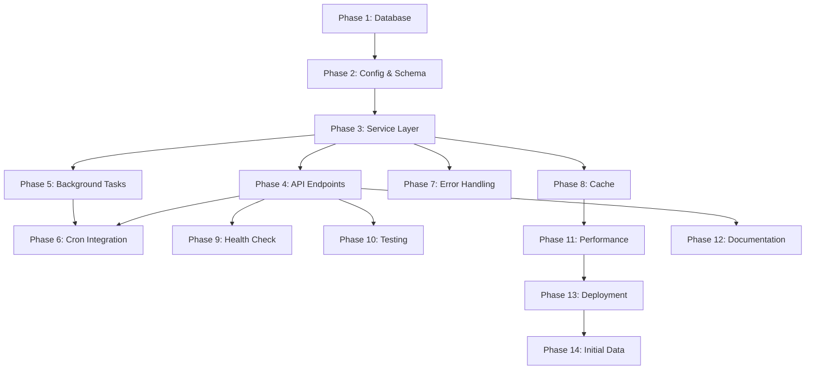

# Fred API統合 - 実装タスクリスト

## 実装概要
DTB3（3ヶ月米国財務省証券金利）データをFred APIから取得し、PostgreSQLデータベースに保存する機能を実装します。

## タスク記法
- [ ] 未着手
- [🔄] 作業中
- [✅] 完了
- [❌] ブロック/エラー
- [⏭️] スキップ

---

## Phase 1: データベース基盤 (Database Foundation)

### Task 1.1: Fredテーブル用マイグレーションファイル作成
- [ ] **ファイル作成**: `app/migrations/versions/009_create_fred_tables.py`
- [ ] **内容**: 
  - `fred_series`テーブル作成（series_id VARCHAR PRIMARY KEY, title VARCHAR(255), units VARCHAR(50), units_short VARCHAR(10), frequency VARCHAR(20), seasonal_adjustment VARCHAR(20), observation_start DATE, observation_end DATE, last_updated TIMESTAMPTZ, popularity INTEGER, notes TEXT, created_at TIMESTAMPTZ DEFAULT NOW(), is_active BOOLEAN DEFAULT TRUE）
  - `fred_observations`テーブル作成（series_id VARCHAR, date DATE, value FLOAT, realtime_start DATE, realtime_end DATE, last_updated TIMESTAMPTZ DEFAULT NOW(), PRIMARY KEY(series_id, date), FOREIGN KEY(series_id) REFERENCES fred_series(series_id)）
  - インデックス作成: `idx_fred_obs_date` ON fred_observations(date)
  - インデックス作成: `idx_fred_obs_series_date` ON fred_observations(series_id, date)
- [ ] **downgrade関数**: DROP TABLE文を正しい順序で実装（fred_observations → fred_series）

### Task 1.2: Fredモデルクラス追加
- [ ] **ファイル更新**: `app/db/models.py`
- [ ] **内容**:
  - `FredSeries`クラス追加（SQLAlchemy ORMモデル、__tablename__ = "fred_series"）
  - `FredObservation`クラス追加（SQLAlchemy ORMモデル、__tablename__ = "fred_observations"）
  - 適切な型ヒント、Column定義、リレーションシップ設定

---

## Phase 2: 設定とスキーマ (Configuration & Schemas)

### Task 2.1: Fred設定を環境変数に追加
- [ ] **ファイル更新**: `app/core/config.py`
- [ ] **追加フィールド**:
  ```python
  FRED_API_KEY: str = ""
  FRED_BASE_URL: str = "https://api.stlouisfed.org/fred"
  FRED_UPDATE_DAYS: int = 30
  FRED_BATCH_SIZE: int = 1000
  FRED_CACHE_TTL: int = 3600
  FRED_RATE_LIMIT: int = 120
  FRED_TIMEOUT: int = 30
  FRED_SERIES_WHITELIST: List[str] = ["DTB3"]
  ```
- [ ] **バリデーター追加**: `FRED_API_KEY`が空の場合の警告ログ

### Task 2.2: .env.exampleファイル更新
- [ ] **ファイル更新**: `.env.example`
- [ ] **追加内容**:
  ```env
  # Fred API Configuration
  FRED_API_KEY=your-fred-api-key-here
  FRED_BASE_URL=https://api.stlouisfed.org/fred
  FRED_UPDATE_DAYS=30
  FRED_BATCH_SIZE=1000
  FRED_CACHE_TTL=3600
  FRED_RATE_LIMIT=120
  FRED_TIMEOUT=30
  ```

### Task 2.3: Pydanticスキーマ作成
- [ ] **ファイル作成**: `app/schemas/fred.py`
- [ ] **スキーマクラス**:
  - `FredSeriesInfo`: series_id(str), title(str), units(str), frequency(str), observation_start(date), observation_end(date), last_updated(datetime), is_active(bool)
  - `FredObservationOut`: date(date), value(Optional[float])
  - `FredDataResponse`: series(FredSeriesInfo), observations(List[FredObservationOut]), metadata(dict)
  - `FredFetchRequest`: series_ids(List[str]), date_from(Optional[date]), date_to(Optional[date]), force_refresh(bool=False)
  - `FredFetchJobResponse`: job_id(str), status(str), series_count(int), date_range(dict)
  - `FredCoverageItem`: series_id(str), total_observations(int), date_start(date), date_end(date), missing_count(int), last_updated(datetime), update_frequency(str), next_update(Optional[datetime])
  - `FredCoverageResponse`: coverage(List[FredCoverageItem])
  - `FredSeriesListResponse`: series(List[FredSeriesInfo]), total(int)

---

## Phase 3: Fredサービス層 (Fred Service Layer)

### Task 3.1: Fredサービスパッケージ初期化
- [ ] **ディレクトリ作成**: `app/services/fred/`
- [ ] **ファイル作成**: `app/services/fred/__init__.py`
- [ ] **内容**: 
  ```python
  from .client import FredApiClient
  from .fetcher import FredDataFetcher
  from .processor import FredDataProcessor
  from .updater import FredDataUpdater
  
  __all__ = ["FredApiClient", "FredDataFetcher", "FredDataProcessor", "FredDataUpdater"]
  ```

### Task 3.2: Fred APIクライアント実装
- [ ] **ファイル作成**: `app/services/fred/client.py`
- [ ] **クラス**: `FredApiClient`
- [ ] **メソッド**:
  - `__init__(self, api_key: str, base_url: str, timeout: int = 30)`
  - `async def get_series_info(self, series_id: str) -> dict`
  - `async def get_observations(self, series_id: str, observation_start: Optional[date], observation_end: Optional[date], limit: int = 100000) -> List[dict]`
  - `async def close(self)`
- [ ] **HTTPクライアント**: httpx.AsyncClientを使用
- [ ] **エラーハンドリング**: HTTPステータスエラー、タイムアウト、JSON解析エラー

### Task 3.3: データ取得サービス実装
- [ ] **ファイル作成**: `app/services/fred/fetcher.py`
- [ ] **クラス**: `FredDataFetcher`
- [ ] **メソッド**:
  - `__init__(self, client: FredApiClient)`
  - `async def fetch_series_data(self, series_id: str, start_date: Optional[date], end_date: Optional[date]) -> Tuple[pd.DataFrame, dict]`
  - `async def validate_data(self, df: pd.DataFrame, series_id: str) -> bool`
- [ ] **データ変換**: JSON → pandas DataFrame
- [ ] **検証**: 重複チェック、NULL値処理、DTB3の場合は0-30%範囲チェック

### Task 3.4: データ処理サービス実装
- [ ] **ファイル作成**: `app/services/fred/processor.py`
- [ ] **クラス**: `FredDataProcessor`
- [ ] **メソッド**:
  - `def normalize_observation_data(self, observations: List[dict]) -> List[dict]`
  - `def fill_missing_dates(self, df: pd.DataFrame, start: date, end: date) -> pd.DataFrame`
  - `def calculate_statistics(self, df: pd.DataFrame) -> dict`
- [ ] **処理内容**: 日付正規化、欠損値処理、統計計算

### Task 3.5: データベース更新サービス実装
- [ ] **ファイル作成**: `app/services/fred/updater.py`
- [ ] **クラス**: `FredDataUpdater`
- [ ] **メソッド**:
  - `async def upsert_series_metadata(self, session: AsyncSession, series_info: dict) -> None`
  - `async def upsert_observations(self, session: AsyncSession, series_id: str, observations: List[dict], batch_size: int = 1000) -> Tuple[int, int]`
  - `async def delete_old_observations(self, session: AsyncSession, series_id: str, before_date: date) -> int`
- [ ] **バッチ処理**: 1000件ずつのバッチでUPSERT実行
- [ ] **トランザクション管理**: 適切なコミット/ロールバック

---

## Phase 4: APIエンドポイント (API Endpoints)

### Task 4.1: Fred APIルーター作成
- [ ] **ファイル作成**: `app/api/v1/fred.py`
- [ ] **ルーター初期化**: `router = APIRouter(prefix="/fred", tags=["fred"])`
- [ ] **依存関数インポート**: `from app.api.deps import get_session`

### Task 4.2: GET /v1/fred/series エンドポイント実装
- [ ] **関数**: `async def list_fred_series(active_only: bool = Query(True), session: AsyncSession = Depends(get_session))`
- [ ] **処理**:
  - fred_seriesテーブルから系列一覧取得
  - active_onlyフィルター適用
  - FredSeriesListResponseで返却
- [ ] **エラーハンドリング**: データベースエラー処理

### Task 4.3: GET /v1/fred/series/{series_id} エンドポイント実装
- [ ] **関数**: `async def get_fred_series_data(series_id: str, date_from: Optional[date], date_to: Optional[date], format: str = Query("json"), include_nulls: bool = Query(False), session: AsyncSession = Depends(get_session))`
- [ ] **処理**:
  - series_idがホワイトリストに存在するか確認
  - fred_observationsテーブルからデータ取得
  - 日付範囲フィルター適用
  - include_nulls=Falseの場合はNULL値除外
  - format="csv"の場合はCSV形式で返却
- [ ] **エラー処理**: 系列が見つからない場合は404

### Task 4.4: POST /v1/fred/fetch エンドポイント実装
- [ ] **関数**: `async def create_fred_fetch_job(request: FredFetchRequest, background_tasks: BackgroundTasks, session: AsyncSession = Depends(get_session))`
- [ ] **処理**:
  - ジョブID生成（fred_YYYYMMDD_HHMMSS_xxxxxx形式）
  - fetch_jobsテーブルにジョブ登録（既存のfetch_jobs再利用）
  - バックグラウンドタスク起動
- [ ] **バックグラウンドタスク**: Fred APIからデータ取得→DB保存

### Task 4.5: GET /v1/fred/coverage エンドポイント実装
- [ ] **関数**: `async def get_fred_coverage(session: AsyncSession = Depends(get_session))`
- [ ] **処理**:
  - 各系列のデータカバレッジ情報取得
  - 最古/最新日付、観測数、欠損数を計算
  - FredCoverageResponseで返却

### Task 4.6: v1ルーターへの統合
- [ ] **ファイル更新**: `app/api/v1/router.py`
- [ ] **追加内容**:
  ```python
  from .fred import router as fred_router
  router.include_router(fred_router)
  ```

---

## Phase 5: バックグラウンドタスク (Background Tasks)

### Task 5.1: Fred取得ワーカー実装
- [ ] **ファイル作成**: `app/services/fred/worker.py`
- [ ] **関数**: `async def process_fred_fetch_job(job_id: str, series_ids: List[str], date_from: date, date_to: date)`
- [ ] **処理フロー**:
  1. fetch_jobsテーブルのステータスを'processing'に更新
  2. FredApiClient初期化（settings.FRED_API_KEY使用）
  3. 各series_idについて:
     - get_series_info()でメタデータ取得
     - get_observations()で観測データ取得
     - upsert_series_metadata()でメタデータ保存
     - upsert_observations()で観測データ保存
  4. fetch_jobsテーブルのステータスを'completed'に更新
- [ ] **エラーハンドリング**: 失敗時はステータスを'failed'に更新

### Task 5.2: リトライロジック実装
- [ ] **ファイル更新**: `app/services/fred/client.py`
- [ ] **クラス追加**: `FredApiRetryStrategy`
- [ ] **メソッド**: `async def execute_with_retry(self, func, *args, **kwargs)`
- [ ] **リトライ条件**: 429（Rate Limit）、5xx系エラー、タイムアウト
- [ ] **バックオフ**: 指数バックオフ（1秒→2秒→4秒...最大60秒）

---

## Phase 6: Cron統合 (Cron Integration)

### Task 6.1: Fred更新関数追加
- [ ] **ファイル更新**: `app/api/v1/cron.py`
- [ ] **関数追加**: `async def update_fred_data(session: AsyncSession, symbols: List[str] = ["DTB3"], days_back: int = 30) -> dict`
- [ ] **処理**:
  - FredDataFetcherで直近days_back日分のデータ取得
  - FredDataUpdaterでデータベース更新
  - 結果dict返却（成功/失敗カウント）

### Task 6.2: daily_updateエンドポイント更新
- [ ] **ファイル更新**: `app/api/v1/cron.py`の`daily_update`関数
- [ ] **追加処理**:
  ```python
  # 既存の株価更新処理の後に追加
  if not request.dry_run:
      fred_results = await update_fred_data(
          session=session,
          symbols=["DTB3"],
          days_back=settings.FRED_UPDATE_DAYS
      )
      logger.info(f"Fred update results: {fred_results}")
  ```

---

## Phase 7: エラーハンドリング (Error Handling)

### Task 7.1: Fred専用エラークラス追加
- [ ] **ファイル更新**: `app/api/errors.py`
- [ ] **クラス追加**:
  - `FredApiError(HTTPException)`: Fred API一般エラー（500）
  - `FredSeriesNotFoundError(HTTPException)`: 系列が見つからない（404）
  - `FredDataValidationError(HTTPException)`: データ検証エラー（422）
  - `FredRateLimitError(HTTPException)`: レート制限エラー（429）

### Task 7.2: エラーハンドリング統合
- [ ] **ファイル更新**: `app/services/fred/client.py`
- [ ] **HTTPエラー変換**: httpx例外をFred専用エラーに変換
- [ ] **Rate Limit対応**: Retry-Afterヘッダーの処理

---

## Phase 8: キャッシュ実装 (Cache Implementation)

### Task 8.1: インメモリキャッシュクラス作成
- [ ] **ファイル作成**: `app/services/fred/cache.py`
- [ ] **クラス**: `FredDataCache`
- [ ] **メソッド**:
  - `get_cache_key(self, series_id: str, start: date, end: date) -> str`
  - `get(self, key: str) -> Optional[pd.DataFrame]`
  - `set(self, key: str, data: pd.DataFrame) -> None`
  - `invalidate(self, series_id: Optional[str] = None) -> None`
- [ ] **TTL管理**: タイムスタンプベースの有効期限チェック

### Task 8.2: キャッシュ統合
- [ ] **ファイル更新**: `app/services/fred/fetcher.py`
- [ ] **キャッシュチェック**: fetch前にキャッシュ確認
- [ ] **キャッシュ更新**: fetch後にキャッシュ設定

---

## Phase 9: ヘルスチェック (Health Check)

### Task 9.1: Fredヘルスチェックエンドポイント追加
- [ ] **ファイル更新**: `app/api/v1/health.py`
- [ ] **エンドポイント追加**: `GET /health/fred`
- [ ] **チェック項目**:
  - fred_seriesテーブルのレコード数
  - DTB3の最新データ日付
  - Fred API疎通確認（軽量エンドポイント使用）
- [ ] **レスポンス**: status(healthy/degraded/unhealthy), fred_api, series_count, latest_dtb3_date, timestamp

---

## Phase 10: テスト実装 (Testing)

### Task 10.1: Fredクライアント単体テスト作成
- [ ] **ファイル作成**: `tests/fred/test_client.py`
- [ ] **テストケース**:
  - `test_get_series_info_success`: 正常系
  - `test_get_series_info_not_found`: 404エラー
  - `test_get_observations_success`: 正常系
  - `test_rate_limit_retry`: 429リトライ
- [ ] **モック使用**: httpxレスポンスをモック

### Task 10.2: Fredエンドポイントテスト作成
- [ ] **ファイル作成**: `tests/fred/test_endpoints.py`
- [ ] **テストケース**:
  - `test_list_series`: GET /v1/fred/series
  - `test_get_series_data`: GET /v1/fred/series/DTB3
  - `test_create_fetch_job`: POST /v1/fred/fetch
  - `test_get_coverage`: GET /v1/fred/coverage
- [ ] **テストクライアント**: FastAPIのTestClient使用

### Task 10.3: Fredサービス統合テスト作成
- [ ] **ファイル作成**: `tests/fred/test_service.py`
- [ ] **テストケース**:
  - `test_fetch_and_save_flow`: データ取得→保存フロー
  - `test_upsert_observations`: UPSERT動作確認
  - `test_cache_functionality`: キャッシュ動作確認
- [ ] **テストDB使用**: PostgreSQLテストインスタンス

---

## Phase 11: パフォーマンス最適化 (Performance Optimization)

### Task 11.1: バルクインサート最適化
- [ ] **ファイル作成**: `app/services/fred/bulk_insert.py`
- [ ] **クラス**: `OptimizedFredUpdater`
- [ ] **メソッド**: `async def bulk_update_with_copy(self, session: AsyncSession, series_id: str, df: pd.DataFrame) -> int`
- [ ] **実装**: PostgreSQL COPY使用、一時テーブル経由でUPSERT

### Task 11.2: クエリ最適化
- [ ] **ファイル更新**: `app/services/fred/updater.py`
- [ ] **最適化項目**:
  - prepared statementの使用
  - バッチサイズ調整（1000→5000）
  - インデックスヒントの追加

---

## Phase 12: ドキュメント更新 (Documentation)

### Task 12.1: OpenAPI仕様更新
- [ ] **自動生成確認**: FastAPIによるOpenAPI仕様が正しく生成されることを確認
- [ ] **エンドポイント説明**: 各エンドポイントのdocstring記載

### Task 12.2: README更新
- [ ] **ファイル更新**: `README.md`（存在する場合）
- [ ] **追加内容**: Fred API統合の使用方法、設定方法

---

## Phase 13: デプロイメント準備 (Deployment Preparation)

### Task 13.1: requirements.txt更新
- [ ] **ファイル更新**: `requirements.txt`
- [ ] **追加パッケージ**: httpxが未追加の場合は追加（pandasとnumpyは既存）

### Task 13.2: render.yaml環境変数追加
- [ ] **ファイル更新**: `render.yaml`
- [ ] **追加内容**:
  ```yaml
  - key: FRED_API_KEY
    sync: false
  - key: FRED_BASE_URL
    value: "https://api.stlouisfed.org/fred"
  - key: FRED_UPDATE_DAYS
    value: "30"
  - key: FRED_BATCH_SIZE
    value: "1000"
  ```

---

## Phase 14: 初期データ投入 (Initial Data Load)

### Task 14.1: DTB3初期データ取得スクリプト作成
- [ ] **ファイル作成**: `scripts/load_fred_dtb3.py`
- [ ] **処理**:
  - Fred APIからDTB3全履歴データ取得（1954年～現在）
  - fred_series、fred_observationsテーブルに保存
  - 進捗表示、エラーハンドリング
- [ ] **実行方法**: `python scripts/load_fred_dtb3.py`

---

## 実装順序と依存関係



---

## 実装の注意事項

### データベース
- マイグレーションは必ず`alembic upgrade head`で実行
- 外部キー制約を適切に設定
- インデックスはCONCURRENTLYオプション使用を検討

### Fred API
- API KEYは環境変数で管理（ハードコード禁止）
- レート制限（120 req/min）を厳守
- エラー時は適切にリトライ

### パフォーマンス
- 大量データはバッチ処理
- キャッシュのTTLは適切に設定
- データベース接続プールを適切に管理

### セキュリティ
- SQLインジェクション対策（パラメータ化クエリ使用）
- 入力値検証（日付範囲、系列IDホワイトリスト）
- ログにAPIキーを出力しない

### テスト
- 各機能の単体テスト作成
- モックを適切に使用（外部API呼び出し）
- エッジケースのテスト（NULL値、重複データ等）

---

## 完了基準

各タスクの完了基準：
1. コードが正常に動作する
2. 適切なエラーハンドリングがある
3. 型ヒントが正しく設定されている
4. PEP8準拠
5. 必要なログ出力がある
6. テストが通る（該当する場合）

全体の完了基準：
1. DTB3データがFred APIから取得できる
2. データベースに保存される
3. APIエンドポイント経由でデータが取得できる
4. 日次cronで自動更新される
5. エラー時に適切にリカバリーする
6. パフォーマンスが許容範囲内

---

## 進捗追跡

総タスク数: 59
- [ ] Phase 1: 2タスク
- [ ] Phase 2: 3タスク  
- [ ] Phase 3: 5タスク
- [ ] Phase 4: 6タスク
- [ ] Phase 5: 2タスク
- [ ] Phase 6: 2タスク
- [ ] Phase 7: 2タスク
- [ ] Phase 8: 2タスク
- [ ] Phase 9: 1タスク
- [ ] Phase 10: 3タスク
- [ ] Phase 11: 2タスク
- [ ] Phase 12: 2タスク
- [ ] Phase 13: 2タスク
- [ ] Phase 14: 1タスク

完了: 0/59 (0%)
