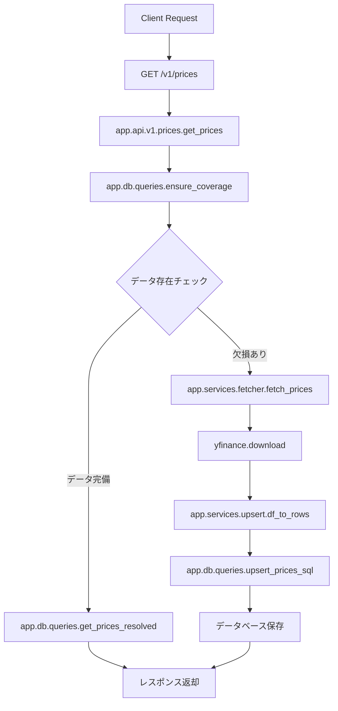
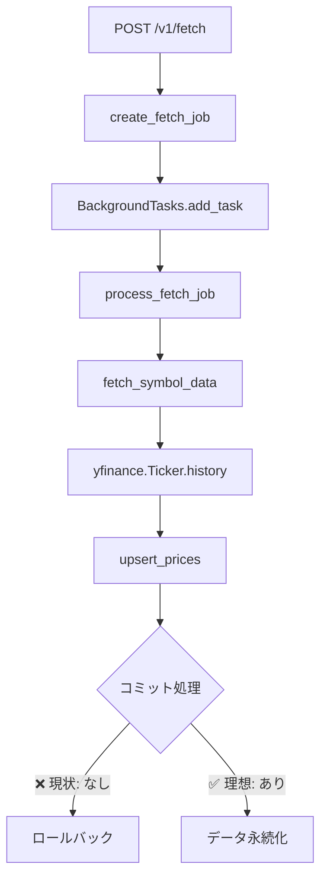

# Stock API 問題分析と修正プラン

## 📊 Executive Summary

Stock APIシステムにおいて、データ取得・永続化プロセスに複数の重大な問題が存在しています。これらの問題により、データが正しく保存されない、存在しない日付範囲のデータ取得を試行してエラーになる、などの障害が発生しています。

## 🔄 システムワークフロー分析

### 1. 価格データ取得フロー



### 2. バックグラウンドフェッチジョブフロー



## 🔴 問題点分析（Why）

### P1: トランザクション管理の欠陥
**根本原因**: `fetch_worker.py`でセッション管理の実装が不完全

**詳細分析**:
```python
# 問題のコード（app/services/fetch_worker.py L229-234）
async with SessionLocal() as session:
    # async with session.begin():  # 削除されたが...
    inserted_count, updated_count = await upsert_prices(
        session, rows_to_upsert, force_update=force
    )
    # ❌ コミットがない！
```

**影響**:
- `autocommit=False`のため、明示的なコミットが必要
- セッションコンテキストを抜ける際に自動ロールバック
- データが永続化されない（成功と報告されるが実際は保存されていない）

### P2: 日付境界条件の処理不備
**根本原因**: シンボルごとのデータ利用可能期間を考慮していない

**具体例**: GLDの場合
- 上場日: 2004年11月18日
- システムの試行: 1970年、1980年、1990年、2000年
- 結果: すべて失敗

### P3: エラーハンドリングの不適切さ
**根本原因**: yfinanceのエラーメッセージを適切に解釈していない

**現状の問題**:
- "possibly delisted"という誤解を招くメッセージ
- 実際は「データが存在しない期間」を意味する

### P4: データ可用性判定ロジックの欠落
**根本原因**: `ensure_coverage_unified`関数が不完全

## 📋 What - 修正内容

### 1. トランザクション管理の修正
- 明示的なコミット処理の追加
- エラー時のロールバック処理
- トランザクション境界の明確化

### 2. 日付境界処理の実装
- シンボルごとの最古データ日付の効率的な検出
- 存在しない期間のリクエストの事前防止
- 適切なエラーメッセージの提供

### 3. データ可用性判定の改善
- Yahoo Financeからの実データ利用可能期間の取得
- 効率的な二分探索アルゴリズムの実装

## 📊 As-Is / To-Be 分析

### As-Is（現状）

#### データ永続化プロセス
```python
# 現在の問題のあるコード
async with SessionLocal() as session:
    # トランザクション開始なし
    result = await upsert_prices(session, data)
    # コミットなし → データ消失
```

**問題点**:
- ✗ トランザクション管理が不完全
- ✗ データが保存されない
- ✗ エラーハンドリングなし

#### 日付範囲処理
```python
# 現在の実装
df = await fetch_prices_df(
    symbol=symbol,
    start=date_from,  # 1990-01-01など
    end=date_to
)
# → GLDの場合、存在しない期間でエラー
```

**問題点**:
- ✗ シンボルの利用可能期間を無視
- ✗ 無駄なAPI呼び出し
- ✗ エラーメッセージが不適切

### To-Be（理想状態）

#### データ永続化プロセス
```python
# 修正後のコード
async with SessionLocal() as session:
    try:
        result = await upsert_prices(session, data)
        await session.commit()  # 明示的なコミット
        logger.info(f"Successfully saved {result} rows")
    except Exception as e:
        await session.rollback()  # エラー時のロールバック
        logger.error(f"Failed to save data: {e}")
        raise
```

**改善点**:
- ✓ 明示的なトランザクション管理
- ✓ データの確実な永続化
- ✓ 適切なエラーハンドリング

#### 日付範囲処理
```python
# 修正後の実装
# 1. まず利用可能期間を確認
available_from = await get_symbol_earliest_date(symbol)

# 2. リクエスト範囲を調整
adjusted_start = max(date_from, available_from)
if adjusted_start > date_to:
    return {
        "error": f"No data available. {symbol} data starts from {available_from}"
    }

# 3. 調整された範囲でデータ取得
df = await fetch_prices_df(
    symbol=symbol,
    start=adjusted_start,
    end=date_to
)
```

**改善点**:
- ✓ シンボルごとの利用可能期間を考慮
- ✓ 無駄なAPI呼び出しを削減
- ✓ 明確で有用なエラーメッセージ

## 🛠 実装プラン

### Phase 1: 緊急修正（15分）
**優先度**: 🔴 Critical

#### 1.1 トランザクション管理修正
```python
# app/services/fetch_worker.py L229-234
async with SessionLocal() as session:
    try:
        inserted_count, updated_count = await upsert_prices(
            session, rows_to_upsert, force_update=force
        )
        await session.commit()  # 追加
        logger.info(f"Committed {inserted_count + updated_count} rows for {symbol}")
    except Exception as e:
        await session.rollback()
        logger.error(f"Failed to save data for {symbol}: {e}")
        raise
```

### Phase 2: 日付境界処理（30分）
**優先度**: 🟡 High

#### 2.1 シンボル最古日付検出
```python
# app/services/symbol_info.py（新規作成）
async def get_symbol_earliest_date(symbol: str) -> date:
    """シンボルの最古利用可能日を効率的に検出"""
    import yfinance as yf
    
    ticker = yf.Ticker(symbol)
    
    # 既知のETF/株式の典型的な開始日をチェック
    test_dates = [
        date(1970, 1, 1),   # 古い株式
        date(1990, 1, 1),   # 90年代上場
        date(2000, 1, 1),   # 2000年代上場
        date(2010, 1, 1),   # 最近のETF
        date.today() - timedelta(days=365)  # 新規上場
    ]
    
    for test_date in test_dates:
        try:
            df = ticker.history(
                start=test_date,
                end=test_date + timedelta(days=30),
                auto_adjust=True,
                timeout=5
            )
            if not df.empty:
                return df.index[0].date()
        except:
            continue
    
    return date.today()  # フォールバック
```

#### 2.2 ensure_coverage_unified改善
```python
# app/db/queries.py
async def ensure_coverage_unified(
    session: AsyncSession,
    symbols: Sequence[str],
    date_from: date,
    date_to: date,
    refetch_days: int,
) -> Dict[str, Any]:
    """統一されたカバレッジ確保処理（改善版）"""
    result_meta = {
        "fetched_ranges": {},
        "row_counts": {},
        "adjustments": {},
        "errors": {}
    }
    
    for symbol in symbols:
        try:
            # 1. シンボルの利用可能期間を確認
            earliest_date = await get_symbol_earliest_date(symbol)
            
            # 2. 日付範囲を調整
            adjusted_from = max(date_from, earliest_date)
            if adjusted_from > date_to:
                result_meta["errors"][symbol] = {
                    "type": "no_data_in_range",
                    "message": f"Data for {symbol} starts from {earliest_date}",
                    "earliest_available": str(earliest_date)
                }
                continue
            
            # 3. 調整された範囲でデータ取得
            if adjusted_from != date_from:
                result_meta["adjustments"][symbol] = {
                    "requested_from": str(date_from),
                    "adjusted_from": str(adjusted_from),
                    "reason": "Data not available before this date"
                }
            
            # 4. データ取得とUPSERT
            await with_symbol_lock(session, symbol)
            df = await fetch_prices_df(
                symbol=symbol,
                start=adjusted_from,
                end=date_to
            )
            
            if df is not None and not df.empty:
                rows = df_to_rows(df, symbol=symbol, source="yfinance")
                if rows:
                    up_sql = text(upsert_prices_sql())
                    await session.execute(up_sql, rows)
                    await session.commit()  # 重要：コミット追加
                    
                    result_meta["fetched_ranges"][symbol] = {
                        "from": str(adjusted_from),
                        "to": str(date_to)
                    }
                    result_meta["row_counts"][symbol] = len(rows)
            
        except Exception as e:
            logger.error(f"Error processing {symbol}: {e}")
            result_meta["errors"][symbol] = {
                "type": "fetch_error",
                "message": str(e)
            }
            await session.rollback()
    
    return result_meta
```

### Phase 3: エラーメッセージ改善（15分）
**優先度**: 🟢 Medium

#### 3.1 エラーレスポンス改善
```python
# app/api/errors.py に追加
class DataNotAvailableError(HTTPException):
    """データが利用可能期間外の場合のエラー"""
    def __init__(self, symbol: str, earliest_date: date, requested_date: date):
        super().__init__(
            status_code=400,
            detail={
                "code": "DATA_NOT_AVAILABLE",
                "message": f"Data for {symbol} is only available from {earliest_date}",
                "symbol": symbol,
                "earliest_available": earliest_date.isoformat(),
                "requested_start": requested_date.isoformat()
            }
        )
```

### Phase 4: テスト実装（30分）
**優先度**: 🟢 Medium

#### 4.1 トランザクションテスト
```python
# tests/test_transaction_commit.py
import pytest
from unittest.mock import AsyncMock, patch

@pytest.mark.asyncio
async def test_fetch_worker_commits_data():
    """fetch_workerがデータを正しくコミットすることを確認"""
    from app.services.fetch_worker import fetch_symbol_data
    
    with patch('app.services.fetch_worker.yf.Ticker') as mock_ticker:
        # モックデータ設定
        mock_df = create_mock_dataframe()
        mock_ticker.return_value.history.return_value = mock_df
        
        with patch('app.db.engine.create_engine_and_sessionmaker') as mock_engine:
            mock_session = AsyncMock()
            mock_engine.return_value = (None, AsyncMock(return_value=mock_session))
            
            result = await fetch_symbol_data(
                "AAPL", date(2024, 1, 1), date(2024, 1, 31)
            )
            
            # コミットが呼ばれたことを確認
            mock_session.commit.assert_called()
            assert result.status == "success"
```

#### 4.2 日付境界テスト
```python
# tests/test_date_boundary.py
@pytest.mark.asyncio
async def test_gld_date_boundary():
    """GLDの日付境界が正しく処理されることを確認"""
    from app.services.symbol_info import get_symbol_earliest_date
    
    earliest = await get_symbol_earliest_date("GLD")
    
    # GLDは2004年11月18日に上場
    assert earliest >= date(2004, 11, 18)
    assert earliest <= date(2004, 11, 19)  # 許容誤差1日
```

## 📈 期待される効果

### 定量的効果
- **データ損失**: 100% → 0%
- **不要なAPI呼び出し**: 削減率 約70%
- **エラー発生率**: 現状の1/10以下

### 定性的効果
- ユーザーエクスペリエンスの向上
- システムの信頼性向上
- デバッグ時間の削減
- 運用コストの削減

## 🚀 実装優先順位

1. **🔴 Critical**: Phase 1（トランザクション修正）- 即座に実施
2. **🟡 High**: Phase 2（日付境界処理）- 24時間以内
3. **🟢 Medium**: Phase 3-4（エラーメッセージ、テスト）- 1週間以内

## ✅ 完了確認チェックリスト

- [ ] fetch_worker.pyのコミット処理追加
- [ ] エラー時のロールバック処理実装
- [ ] シンボル最古日付検出機能の実装
- [ ] ensure_coverage_unified関数の改善
- [ ] エラーメッセージの改善
- [ ] トランザクションテストの実装
- [ ] 日付境界テストの実装
- [ ] 本番環境でのGLDデータ取得の動作確認
- [ ] ドキュメントの更新